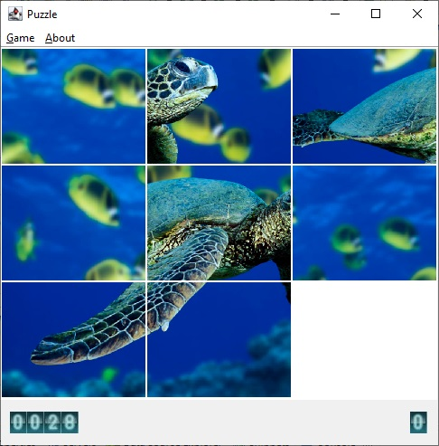
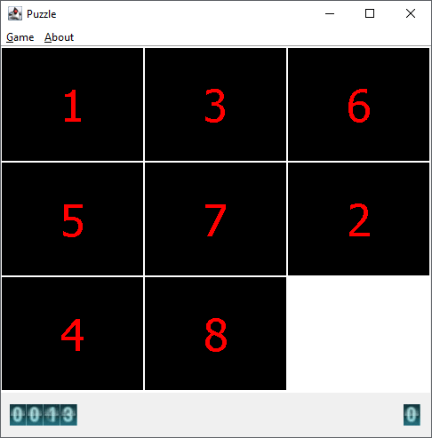
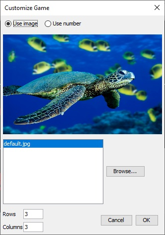

### puzzle-game
A puzzle game using Java AWT

A picture is divided into tiles by row and column and then those tiles are moved randomly. A player has to move each file to its original position.
The game is finished when the player moves all tiles to their right place.

- Puzzle with an image  
  

- Puzzle with numbers  
  It is easier to know where is the right place of a tile when tiles are labeled with numbers.  
  

- Game customization  
  

To-do list
  - [ ] It is sometimes hard to figure out right places for tiles so the complete image should be displayed if the player needs
  - [ ] Add animation
  - [ ] Highlight the tile which mouse is on
  - [ ] Showing Option dialog is not smooth maybe due to loading files
